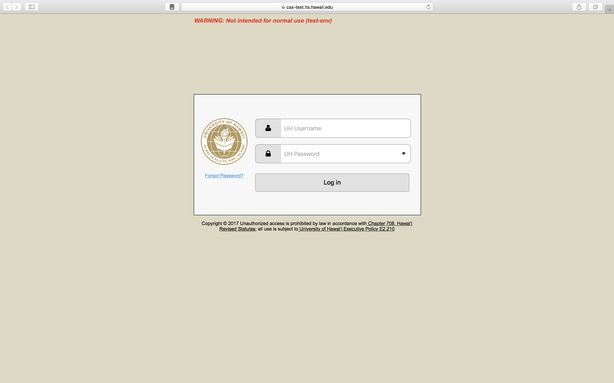
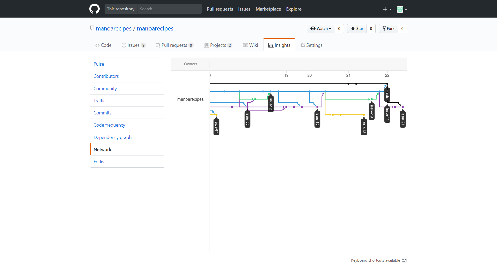

# Table of contents

* [About Manoa Recipes](#about-manoa-recipes)
* [Installation](#installation)
* [Goals](#goals)
* [Application design](#application-design)
  * [Directory structure](#directory-structure)
  * [Import conventions](#import-conventions)
  * [Naming conventions](#naming-conventions)
  * [Data model](#data-model)
  * [CSS](#css)
  * [Routing](#routing)
  * [Authentication](#authentication)
  * [Authorization](#authorization)
  * [Configuration](#configuration)
  * [Quality Assurance](#quality-assurance)
   * [ESLint](#eslint)
* [Development history](#development-history)
  * [Milestone 1: Mockups and Collections](#milestone-1-mockup-development)
  * [Milestone 2: Data model development](#milestone-2-data-model-development)
* [Development History](#development-history)
  * [Week 1:Website Development](#week-1-website-development)
  * [Milestone 1: Mockups and Collections](#milestone-1-mockups-and-collections)
  * [Milestone 2: Connecting the Data](#milestone-2-connecting-the-data)
* [Deployment to Galaxy](#deployment-to-galaxy)
  * [Click to go to Deployed App](http://manoarecipes.meteorapp.com)

# About Manoa Recipes

Manoa Recipes is a Meteor application providing recipes for the University of Hawaii community. In the application, users can search recipes by ingredient, add recipes to the database, save recipes to their profile, and view local grocery ads.

When the site is first accessed, even before they log in, users may filter through ingredients to view recipes that fit their cravings:


As a non-logged-in guest, users may still access several application features, including the recipe database and the weekly ads. Manoa Recipes utilizes UH Manoa's Central Authentication System (CAS) to allow access to those with UH login credentials:


Once logged in, the user is taken to their profile page, which at first will be mostly empty:


The user can update their profile to better represent themselves:


They can browse through the entire database of recipes:


Once logged in, users can favorite recipes by clicking the star on any card. These recipes will appear on their profile page:


Clicking on the recipe photo will bring the user to the recipe's display page:


Users can also populate the database with their own recipes:


Once the recipes are in the system, they will appear on the user's profile page, and may be edited or deleted only by those users:


Or they can access the weekly ads, which will be updated weekly by our admins:


# Installation

First, [install Meteor](https://www.meteor.com/install).

Second, [download a copy of Manoa Recipes](https://github.com/manoarecipes/manoarecipes/archive/master.zip), or clone it using git.
  
Third, cd into the app/ directory and install libraries with:

```
$ meteor npm install
```

Fourth, run the system with:

```
$ meteor npm run start
```

If all goes well, the application will appear at [http://localhost:3000](http://localhost:3000). If you have an account on the UH test CAS server, you can login.  


# Goals

The goal of this project is to develop an application for users and the public to share recipes. The public will be able to browse recipes by category or tag. Users will be able to log in, create a profile, create recipes, and save recipes for future reference. Once the basic database is up and running, we will focus on improving the aesthetics of the application, as well as implementing a comments section for each recipe.


# Application Design

## Directory structure

The top-level directory structure contains:

```
app/        # holds the Meteor application sources
config/     # holds configuration files, such as settings.development.json
.gitignore  # don't commit IntelliJ project files, node_modules, and settings.production.json
```

This structure separates configuration files (such as the settings files) in the config/ directory from the actual Meteor application in the app/ directory.

The app/ directory has this top-level structure:

```
client/
  lib/           # holds Semantic UI files.
  head.html      # the <head>
  main.js        # import all the client-side html and js files. 

imports/
  api/           # Define collection processing code (client + server side)
    base/
    ingredients/
    profile/
    recipe/
    tag/
    
  startup/       # Define code to run when system starts up (client-only, server-only)
    client/        
    server/        
  ui/
    components/  # templates that appear inside a page template.
    layouts/     # Layouts contain common elements to multiple pages (i.e. menubar and footer)
    pages/       # Pages are navigated to by FlowRouter routes.
    stylesheets/ # CSS customizations, if any.

node_modules/    # managed by Meteor

private/
  database/      # holds the JSON file used to initialize the database on startup.

public/          
  images/        # holds static images for landing page and predefined sample users.
  
server/
   main.js       # import all the server-side js files.
```

## Import conventions

This system adheres to the Meteor 1.4 guideline of putting all application code in the imports/ directory, and using client/main.js and server/main.js to import the code appropriate for the client and server in an appropriate order.

This system accomplishes client and server-side importing in a different manner than most Meteor sample applications. In this system, every imports/ subdirectory containing any Javascript or HTML files has a top-level index.js file that is responsible for importing all files in its associated directory.   

Then, client/main.js and server/main.js are responsible for importing all the directories containing code they need. For example, here is the contents of client/main.js:

```
import '/imports/startup/client';
import '/imports/ui/components/form-controls';
import '/imports/ui/components/directory';
import '/imports/ui/components/user';
import '/imports/ui/components/landing';
import '/imports/ui/components/recipe-directory';
import '/imports/ui/layouts/directory';
import '/imports/ui/layouts/landing';
import '/imports/ui/layouts/open-access';
import '/imports/ui/layouts/shared';
import '/imports/ui/layouts/user';
import '/imports/ui/pages/recipe-directory';
import '/imports/ui/pages/filter';
import '/imports/ui/pages/filter-ingredients';
import '/imports/ui/pages/landing';
import '/imports/ui/pages/admin';
import '/imports/ui/pages/weekly-ad';
import '/imports/ui/pages/view-recipe';
import '/imports/ui/pages/user';
import '/imports/api/base';
import '/imports/api/profile';
import '/imports/api/recipe';
import '/imports/api/ingredients';
import '/imports/api/tag';
import '/imports/ui/stylesheets/style.css';
```

Apart from the last line that imports style.css directly, the other lines all invoke the index.js file in the specified directory.

We use this approach to make it more simple to understand what code is loaded and in what order, and to simplify debugging when some code or templates do not appear to be loaded.  In our approach, there are only two places to look for top-level imports: the main.js files in client/ and server/, and the index.js files in import subdirectories. 

Note that this two-level import structure ensures that all code and templates are loaded, but does not ensure that the symbols needed in a given file are accessible.  So, for example, a symbol bound to a collection still needs to be imported into any file that references it. 
 
## Naming conventions

This system adopts the following naming conventions:

  * Files and directories are named in all lowercase, with words separated by hyphens. Example: accounts-config.js
  * "Global" Javascript variables (such as collections) are capitalized. Example: Profiles.
  * Other Javascript variables are camel-case. Example: collectionList.
  * Templates representing pages are capitalized, with words separated by underscores. Example: Directory_Page. The files for this template are lower case, with hyphens rather than underscore. Example: directory-page.html, directory-page.js.
  * Routes to pages are named the same as their corresponding page. Example: Directory_Page.


## Data model

The Manoa Recipes data model is implemented by four Javascript classes: [ProfileCollection](https://github.com/manoarecipes/manoarecipes/tree/master/app/imports/api/profile), [IngredientsCollection](https://github.com/manoarecipes/manoarecipes/tree/master/app/imports/api/ingredients), [RecipeCollection](https://github.com/manoarecipes/manoarecipes/tree/master/app/imports/api/recipe), and [TagCollection](https://github.com/manoarecipes/manoarecipes/tree/master/app/imports/api/tag). All of these classes encapsulate a MongoDB collection with the same name and export a single variable (Profiles, Ingredients, Recipes, and Tags)that provides access to that collection. 

Any part of the system that imports the Profiles, Ingredients, Recipes, or Tags variable invokes methods of that class to get or set data.

There are many common operations on MongoDB collections. To simplify the implementation, the ProfileCollection, IngredientsCollection, RecipeCollection, and TagCollection classes inherit from the [BaseCollection](https://github.com/manoarecipes/manoarecipes/blob/master/app/imports/api/base/BaseCollection.js) class.

The [BaseUtilities](https://github.com/manoarecipes/manoarecipes/blob/master/app/imports/api/base/BaseUtilities.js) file contains functions that operate across all classes. 

## CSS

The application uses the [Semantic UI](http://semantic-ui.com/) CSS framework. To learn more about the Semantic UI theme integration with Meteor, see [Semantic-UI-Meteor](https://github.com/Semantic-Org/Semantic-UI-Meteor).

The Semantic UI theme files are located in [app/client/lib/semantic-ui](https://github.com/ics-software-engineering/meteor-application-template/tree/master/app/client/lib/semantic-ui) directory. Because they are located in the client/ directory and not the imports/ directory, they do not need to be explicitly imported to be loaded. (Meteor automatically loads all files into the client that are located in the client/ directory). 

Note that the user pages contain a menu fixed to the top of the page, and thus the body element needs to have padding attached to it.  However, the landing page does not have a menu, and thus no padding should be attached to the body element on that page. To accomplish this, the [router](https://github.com/manoarecipes/manoarecipes/blob/master/app/imports/startup/client/router.js) uses "triggers" to add an remove the appropriate classes from the body element when a page is visited and then left by the user. 

## Routing

For display and navigation among its four pages, the application uses [Flow Router](https://github.com/kadirahq/flow-router).

Routing is defined in [imports/startup/client/router.js](https://github.com/manoarecipes/manoarecipes/blob/master/app/imports/startup/client/router.js).

Manoa Recipes defines the following routes:

  * The `/` route goes to the public landing page.
  * The `/filter-ingredients` route goes to the public filter ingredients page.
  * The `/recipe-directory` route goes to the public recipe directory page.
  * The `/weekly-ad` route goes to the public weekly-ad page.
  * The `/view/<recipeNum>` route goes to the public recipe view page associated with '<recipeNum>', which is the identifying number for recipes.
  * The `/<user>/` route goes to the landing page associated with `<user>`, which is the UH account name.
  * The `/<user>/profile` route goes to the profile page associated with `<user>`.
  * The `/<user>/edit-profile` route goes to the edit profile page associated with `<user>`.
  * The `/<user>/weekly-ad` route goes to the weekly-ad page associated with `<user>`.
  * The `/<user>/add-recipe` route goes to the add recipe page associated with `<user>`.
  * The `/<user>/filter-ingredients` route goes to the filter ingredients page associated with `<user>`.
  * The `/<user>/view/<recipeNum>` route goes to the add recipe page associated with `<user>` and '<recipeNum>'.
  * The `/<user>/edit/<recipeNum>` route goes to the edit recipe page associated with `<user>` and '<recipeNum>'.
  * The `/<user>/delete/<recipeNum>` route goes to the add recipe page associated with `<user>` and '<recipeNum>'.

## Authentication

For authentication, the application uses the University of Hawaii CAS test server, and follows the approach shown in [meteor-example-uh-cas](http://ics-software-engineering.github.io/meteor-example-uh-cas/).

When the application is run, the CAS configuration information must be present in a configuration file such as  [config/settings.development.json](https://github.com/ics-software-engineering/meteor-application-template/blob/master/config/settings.development.json). 

Anyone with a UH account can login and use Manoa Recipes to create a profile.  A profile document is created for them if none already exists for that username.

## Authorization

The landing, ingredient filter, recipe directory, and weekly ad pages are public; anyone can access those pages.

The user pages require authorization: you must be logged in (i.e. authenticated) through the UH test CAS server, and the authenticated username returned by CAS must match the username specified in the URL.  So, for example, only the authenticated user `sean` can access the pages `http://localhost:3000/sean/profile` and  `http://localhost:3000/sean/add-recipe`.

To prevent people from accessing pages they are not authorized to visit, template-based authorization is used following the recommendations in [Implementing Auth Logic and Permissions](https://kadira.io/academy/meteor-routing-guide/content/implementing-auth-logic-and-permissions). 

The application implements template-based authorization using an If_Authorized template, defined in [If_Authorized.html](https://github.com/manoarecipes/manoarecipes/blob/master/app/imports/ui/layouts/user/if-authorized.html) and [If_Authorized.js](https://github.com/manoarecipes/manoarecipes/blob/master/app/imports/ui/layouts/user/if-authorized.js).

## Configuration

The [config](https://github.com/manoarecipes/manoarecipes/tree/master/config) directory is intended to hold settings files.  The repository contains one file: [config/settings.development.json](https://github.com/manoarecipes/manoarecipes/blob/master/config/settings.development.json).

The [.gitignore](https://github.com/manoarecipes/manoarecipes/blob/master/.gitignore) file prevents a file named settings.production.json from being committed to the repository. So, if you are deploying the application, you can put settings in a file named settings.production.json and it will not be committed.

Manoa Recipes checks on startup to see if it has an empty database in [initialize-database.js](https://github.com/manoarecipes/manoarecipes/blob/master/app/imports/startup/server/initialize-database.js), and if so, loads the file specified in the configuration file, such as [settings.development.json](https://github.com/manoarecipes/manoarecipes/blob/master/config/settings.development.json).  For development purposes, a sample initialization for this database is in [initial-collection-data.json](https://github.com/manoarecipes/manoarecipes/blob/master/app/private/database/initial-collection-data.json).

## Quality Assurance

### ESLint

Manoa Recipes includes a [.eslintrc](https://github.com/manoarecipes/manoarecipes/blob/master/app/.eslintrc) file to define the coding style adhered to in this application. You can invoke ESLint from the command line as follows:

```
meteor npm run lint
```

ESLint should run without generating any errors.  

It's significantly easier to do development with ESLint integrated directly into your IDE (such as IntelliJ).

# Development History

This project is a work-in-progress.

The following sections document the history of Manoa Recipes.

## Week 1: Website Development

We created a Github organization to host our code and attached our website repository. As a group, we decided the basic functionality of our application and developed the following mockups:


## Milestone 1: Mockups and Collections

This milestone started on November 10, 2017 and ended on November 22, 2017

The goal of Milestone 1 was to create mockups of the core pages of the project, and if there was time, to start working on creating the collections.

Mockups for the following five pages were implemented during M1:


[](http://manoarecipes.meteorapp.com/)

[](http://manoarecipes.meteorapp.com/mserai/profile)

[](http://manoarecipes.meteorapp.com/mserai/edit-profile)

[](http://manoarecipes.meteorapp.com/mserai/recipe-directory)

[](http://manoarecipes.meteorapp.com/mserai/add-recipe)


Milestone 1 was implemented as [Manoa Recipes Milestone M1](https://github.com/manoarecipes/manoarecipes/milestone/1)::


Milestone 1 was implemented through Issue Driven Project Management [Manoa Recipes Network Graph](https://github.com/manoarecipes/manoarecipes/network):: 

## Milestone 2: Connecting the data

This milestone started on November 22, 2017

Milestone 2 is being implemented as [Manoa Recipes Milestone M2](https://github.com/manoarecipes/manoarecipes/milestone/2)


Milestone 2 consisted of 20 issues, and progress was managed via the [Manoa Recipes GitHub Project M2](https://github.com/manoarecipes/manoarecipes/milestone/2?closed=1):


Each issue was implemented in its own branch, and merged into master when completed:


# Deployment to Galaxy
The project was deployed through Galaxy and [may be found here](https://manoarecipes.meteorapp.com):: 
