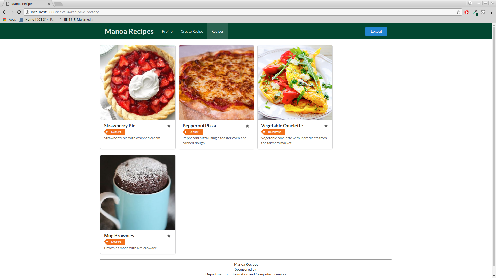

# Table of contents

* [About Manoa Recipes](#about-manoa-recipes)
  * [Goals](#goals)
* [Development History](#development-history)
  * [Week 1:Website Development](#week-1-website-development)
  * [Milestone 1: Mockups and Collections](#milestone-1-mockups-and-collections)
  * [Milestone 2: Connecting the Data](#milestone-2-connecting-the-data)

# About Manoa Recipes

Manoa Recipes is a Meteor application providing recipes for the University of Hawaii community.

## Goals

The goal of this project is to develop an application for users and the public to share recipes. The public will be able to browse recipes by category or tag. Users will be able to log in, create a profile, create recipes, and save recipes for future reference. Other features can be implemented but the aforementioned are the basics.

# Development History

This project is a work-in-progress.

The following sections document the history of Manoa Recipes.

## Week 1: Website Development

We created a Github organization to host our code and attached our website repository. As a group, we decided the basic functionality of our application and developed the following mockups:

## Milestone 1: Mockups and Collections

This milestone started on November 10, 2017 and ended on November 22, 2017

The goal of Milestone 1 was to create mockups of the core pages of the project, and if there was time, to start working on creating the collections.

Mockups for the following five pages were implemented during M1:

[Landing Page](http://manoarecipes.meteorapp.com/), [Profile Page](http://manoarecipes.meteorapp.com/mserai/profile), [Edit Profile](http://manoarecipes.meteorapp.com/mserai/edit-profile), [Recipe Directory](http://manoarecipes.meteorapp.com/mserai/recipe-directory),  [Add Recipe Page](http://manoarecipes.meteorapp.com/mserai/add-recipe)

Milestone 1 was implemented as [Manoa Recipes Milestone M1](https://github.com/manoarecipes/manoarecipes/milestone/1)::

Milestone 1 was implemented as [Manoa Recipes Milestone M1](https://github.com/manoarecipes/manoarecipes/milestone/1)::

The project was deployed through Galaxy and [may be found here](https://galaxy.meteor.com/app/manoarecipes.meteorapp.com)::

## Milestone 2: Connecting the data

This milestone started on November 22, 2017

Milestone 2 is being implemented as [Manoa Recipes Milestone M2](https://github.com/manoarecipes/manoarecipes/milestone/2)
